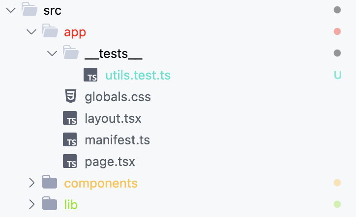

# Folder Regex Color (Folder Path Color with Regex format)

> Fork of [Folder Path Color](https://marketplace.visualstudio.com/items?itemName=VisbyDev.folder-path-color), but with regex paths

This extension allows you to color-code folders and files in Visual Studio Code by specifying paths regex and colors in your workspace settings. The colors are visible in the Explorer view and in the tabs, unless overridden by the app.




Works in search and tabs as well.


## Features

This extension provides the ability to customize the appearance of folders in your workspace explorer. You can assign colors and symbols to folders based on their paths, and the assigned color and symbol will be displayed next to the folder name. You can also specify a tooltip for each folder, which will be displayed when you hover over the folder's symbol.

There are 20 slots for custom colors available, which you can update with the `workbench.colorCustomizations` user setting.

> [!NOTE]
> It's important to note that when a file is under source control and there are changes to be committed, Git will overwrite the file's color with its own color scheme. However, the symbol assigned by this extension will remain visible next to the file name. The custom color will still be shown for folders with Git changes.

In the source control tab, custom colors on files won't be visible due to VS Code's design, but the symbol will still be displayed next to the file name, providing a visual cue even in this scenario.

## Example Configuration

```json
// VS Code User Config
"folder-regex-color.folders": [
    {
      "regex": ".*test.ts$",
      "color": "custom1"
    },
    {
      "regex": "src/app$",
      "color": "custom2"
    },
    {
      "regex": "src/components$",
      "color": "custom3"
    },
    {
      "regex": "src/lib$",
      "color": "custom4"
    },
    {
      "regex": "src/utils$",
      "color": "custom5"
    }
  ],
  "workbench.colorCustomizations": {
    // Folder Regex Plugin
    "folderRegexColor.custom1": "#31e2cd",
    "folderRegexColor.custom2": "#ff0000",
    "folderRegexColor.custom3": "#ffc23d",
    "folderRegexColor.custom4": "#8ee414",
    "folderRegexColor.custom5": "#FF88CC"
  }
```

## Requirements

This extension does not have any additional requirements or dependencies.

## Extension Settings

- `folder-regex-color.folders`: An array of objects representing the folders to be colored. Each object can have the following properties:

| Property  | Type   | Description                                                                                                                                       |
| --------- | ------ | ------------------------------------------------------------------------------------------------------------------------------------------------- |
| `regex`   | string | The regex of the folder, relative to the workspace.                                                                                               |
| `color`   | string | The color to assign to the folder. This should be one of the predefined color names.                                                              |
| `symbol`  | string | A short symbol to display next to the folder. This should be a string of maximum 2 characters. You can also use an emoji for more visual display. |
| `tooltip` | string | A tooltip to display when you hover over the folder's symbol.                                                                                     |

Predefined color names: `blue`, `magenta`, `red`, `cyan`, `green`, `yellow`, and `custom1` through `custom20`.

Example configuration:

```json
"folder-regex-color.folders": [
    { "regex": "frontend", "symbol": "⚛️", "tooltip": "Frontend Source", "color": "custom1" },
    { "regex": "packages/common", "symbol": "📦", "tooltip": "Common Packages", "color": "custom2" }
]
```

- `folderRegexColor`: A color object with 20 slots to use for custom HEX codes. Used under the `workbench.colorCustomizations` user setting.

| Property   | Type   | Default based on theme (Dark/Light) |
| ---------- | ------ | ----------------------------------- |
| `custom1`  | string | `#ABCDEF` / `#123456`               |
| `custom2`  | string | `#FEDCBA` / `#654321`               |
| `custom3`  | string | `#AADDFF` / `#336699`               |
| `custom4`  | string | `#FF99AA` / `#882244`               |
| `custom5`  | string | `#AAFF99` / `#448822`               |
| `custom6`  | string | `#AA99FF` / `#442288`               |
| `custom7`  | string | `#FF88CC` / `#993366`               |
| `custom8`  | string | `#88FFCC` / `#339966`               |
| `custom9`  | string | `#CC88FF` / `#663399`               |
| `custom10` | string | `#FFCC88` / `#996633`               |
| `custom11` | string | `#88CCFF` / `#336699`               |
| `custom12` | string | `#FF88CC` / `#993366`               |
| `custom13` | string | `#88FFAA` / `#338844`               |
| `custom14` | string | `#FFAA88` / `#884433`               |
| `custom15` | string | `#AA88FF` / `#443388`               |
| `custom16` | string | `#88AAFF` / `#334488`               |
| `custom17` | string | `#FFAA44` / `#884422`               |
| `custom18` | string | `#44FFAA` / `#228844`               |
| `custom19` | string | `#AA44FF` / `#442288`               |
| `custom20` | string | `#44AAFF` / `#224488`               |

Example configuration with custom colors:

```json
"workbench.colorCustomizations": {
    "folderRegexColor.custom1": "#FF4488",
    "folderRegexColor.custom2": "#88ff44",
    "folderRegexColor.custom3": "#4488FF",
    "folderRegexColor.custom4": "#FF88CC",
    "folderRegexColor.custom5": "#88FFAA"
}
```

## Following extension guidelines

This extension follows the [Extension Guidelines](https://code.visualstudio.com/api/references/extension-guidelines) provided by Visual Studio Code.

**Enjoy!**
